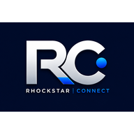

# 🚀 Rhockstar Connect (`rhockstarconnect.com`)

<div align="center">



### **The All-In-One Professional Networking, Job Matching, Public Communities & Social Platform**

[](https://rhockstarconnect.com)
[](https://nextjs.org/)
[](https://react.dev/)
[](https://firebase.google.com/)
[](https://tailwindcss.com/)
[](https://rhockstarconnect.com)

</div>

---

## 📖 Overview

**Rhockstar Connect** is a state-of-the-art social network built for students, freelancers, job seekers, and young professionals. It seamlessly integrates professional networking, career advancement, employer applicant tracking (ATS), interest-based dating, and modern 2go-style public chat communities into a single fluid web application.

Designed with modern UI aesthetics, dynamic theme options, and real-time database synchronization, Rhockstar Connect empowers users to connect, collaborate, land opportunities, and build meaningful relationships.

---

## ✨ Core Features

### 🌐 1. Public Chat Communities ("2go-Style" Modern Rooms)
- **Open Discovery Directory**: Browse and search public chat rooms by category (*Sports*, *Tech & Career*, *Hobbies*, *Campus*, *General*).
- **Instant Join**: Join any public room without invitations.
- **Custom Emojis & Room Creation**: Users can create their own public community with custom icons (`⚽`, `💻`, `💼`, `🎵`, `🎮`, `🎓`, `🔥`).
- **Creator Admin Controls**: Room creators receive **Creator Crown 👑** badges and admin tools to moderate messages and manage member rosters.

### 💬 2. Direct Messaging & Media Sharing
- **1-on-1 Real-time Chat**: Synchronous direct messaging powered by Firestore real-time listeners.
- **Rich Media & File Uploads**: Upload images, audio clips, and documents directly within chats.
- **Reply & Status Controls**: Quote replies, delivery/read statuses, and thread management.

### 💼 3. Job Board & Employer ATS Dashboard
- **Comprehensive Job Search**: Search and filter opportunities by industry, location, job type, and experience level.
- **Employer Portal & ATS**: Employers can publish job listings, view candidate applications, inspect resumes, and manage applicant statuses.
- **Company Pages**: Public directory showcasing hiring companies and open positions.

### 💕 4. Social Networking & Dating Matchmaking
- **Dating Profiles**: Dedicated dating profile creation with mutual interest matching and status badges.
- **Social Feed & Engagement**: Share posts, media updates, likes, and comments with your network.

### 🪩 5. Dynamic Theme Engine
- **Cyberpunk Neon Purple (Default)**: Deep obsidian dark background (`#090314`) with glowing violet radial lighting.
- **Multi-Theme Palette**: Switch dynamically between *Neon Purple*, *Ocean Blue*, *Emerald Green*, *Rose Pink*, and *Amber Gold* in Account Settings.

### 🛡️ 6. Admin Portal & System Oversight
- **User & Subscription Moderation**: Oversee user accounts, verify credentials, and manage subscription tiers (*Free*, *Pro*, *Elite*).
- **Report & Content Management**: Inspect user reports, flagged content, and system analytics.

---

## 🛠️ Technology Stack

| Layer | Technologies Used |
| :--- | :--- |
| **Frontend Framework** | [Next.js 16 (App Router)](https://nextjs.org/), [React 19](https://react.dev/) |
| **Styling & UI** | [Tailwind CSS](https://tailwindcss.com/), Vanilla CSS Tokens, Lucide Icons, Date-fns |
| **Database & Auth** | [Google Firebase](https://firebase.google.com/) (Firestore, Auth, Storage), Firebase Admin SDK |
| **State Management** | Zustand (`useAuthStore`) |
| **Deployment & Hosting** | [Netlify](https://www.netlify.com/) (Production Domain: [`rhockstarconnect.com`](https://rhockstarconnect.com)) |
| **Compiler & Build** | Next.js Turbopack, Node.js (`--max-old-space-size=4096`) |

---

## 📁 Project Directory Structure

```text
Rhockstar-Connect/
├── public/                     # Static assets & public images
├── src/
│   ├── app/                    # Next.js App Router Pages & API Routes
│   │   ├── (dashboard)/        # Main App Dashboard layout & routes
│   │   │   ├── feed/           # Social Feed page
│   │   │   ├── jobs/           # Job Board page
│   │   │   ├── messages/       # Direct Chats & Public Communities page
│   │   │   ├── network/        # User Network & Connections page
│   │   │   ├── dating/         # Dating & Matchmaking page
│   │   │   ├── employer/       # Employer ATS Dashboard
│   │   │   └── settings/       # Account Settings & Theme Selector
│   │   ├── admin/              # Admin Moderation Portal
│   │   └── api/                # Next.js Serverless API endpoints
│   ├── components/             # Reusable UI Components
│   │   ├── chat/               # Chat modals & community creation
│   │   ├── layout/             # Sidebar, Navbar & Theme Container
│   │   └── ui/                 # Cards, Buttons & Badges
│   ├── lib/
│   │   ├── firebase.ts         # Firebase Client SDK Configuration
│   │   ├── firebaseAdmin.ts    # Firebase Admin SDK Server Setup
│   │   ├── constants/          # Themes & System Constants
│   │   └── services/           # Firestore Data Services
│   │       ├── communities.ts  # Public Communities service
│   │       ├── messages.ts     # Direct Messaging service
│   │       ├── jobs.ts         # Job Board service
│   │       └── users.ts        # User Profiles service
│   └── store/                  # Global Zustand Store (`useAuthStore`)
├── netlify.toml                # Netlify deployment configuration
├── package.json                # Project dependencies & build scripts
└── README.md                   # Project documentation
```

---

## 🚀 Getting Started

### Prerequisites
Ensure you have the following installed on your local machine:
- **Node.js**: `v18.x` or higher
- **npm**: `v9.x` or higher (or `pnpm` / `yarn`)

### 1. Clone the Repository
```bash
git clone https://github.com/KingPraise/Rhockstar-Connect.git
cd Rhockstar-Connect
```

### 2. Install Dependencies
```bash
npm install
```

### 3. Configure Environment Variables
Create a `.env.local` file in the root directory and add your Firebase credentials:

```env
NEXT_PUBLIC_FIREBASE_API_KEY=your_api_key
NEXT_PUBLIC_FIREBASE_AUTH_DOMAIN=your_auth_domain
NEXT_PUBLIC_FIREBASE_PROJECT_ID=your_project_id
NEXT_PUBLIC_FIREBASE_STORAGE_BUCKET=your_storage_bucket
NEXT_PUBLIC_FIREBASE_MESSAGING_SENDER_ID=your_sender_id
NEXT_PUBLIC_FIREBASE_APP_ID=your_app_id

FIREBASE_ADMIN_PROJECT_ID=your_project_id
FIREBASE_ADMIN_CLIENT_EMAIL=your_client_email
FIREBASE_ADMIN_PRIVATE_KEY=your_private_key
```

### 4. Run Development Server
```bash
npm run dev
```
Open [http://localhost:3000](http://localhost:3000) in your browser to view the application.

---

## 🛠️ Production Build & Verification

To verify that all TypeScript types and static pages compile cleanly:

```bash
npm run build
```

---

## 🌐 Production Deployment Protocol

Rhockstar Connect is deployed live on Netlify via Netlify Cloud Continuous Integration (CI/CD).

Whenever changes are committed and pushed to `main`, Netlify automatically builds Next.js in the cloud and updates [`https://rhockstarconnect.com`](https://rhockstarconnect.com):

```bash
git push origin main
```

---

## 🤝 Contributing

Contributions, issues, and feature requests are welcome! Feel free to check the [issues page](https://github.com/KingPraise/Rhockstar-Connect/issues).

1. Fork the repository
2. Create your feature branch (`git checkout -b feature/AmazingFeature`)
3. Commit your changes (`git commit -m 'Add some AmazingFeature'`)
4. Push to the branch (`git push origin feature/AmazingFeature`)
5. Open a Pull Request

---

## 📜 License

This project is open source and available under the [MIT License](LICENSE).

<div align="center">
  <sub>Built with ❤️ by KingPraise & the Rhockstar Connect Team</sub>
</div>
